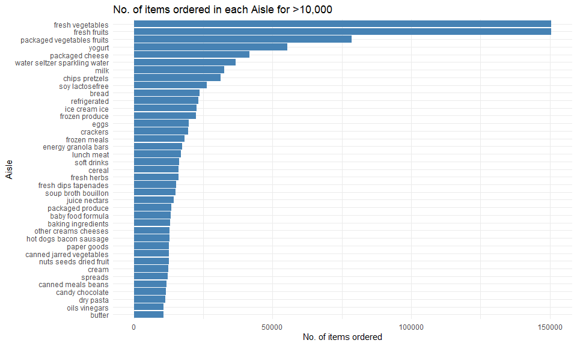
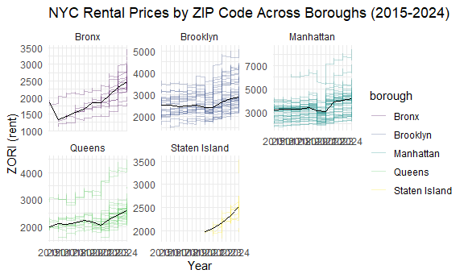
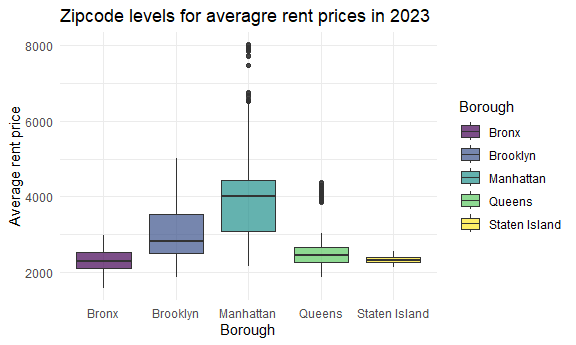
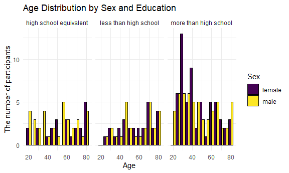
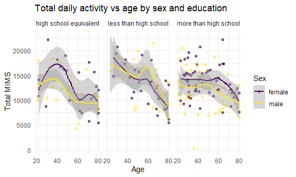
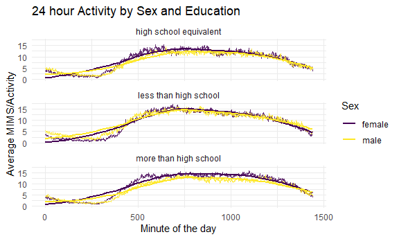

Homework 3
================
Eman Ibrahim (ei2291)

## Problem 1

Import the instacart data

``` r
data("instacart")
```

The dataset tells us briefly about how many people ordered their
groceries online through instacart. It tells us what they ordered etc.
The dataset has 1,384,617 observations and 15 variables.Since each row
in this dataset shows a product with a user’s order, Some key variables
are `user_id`. `product_id`, `order_id`, `order_number`, `aisle`,
`product_name`, `order_number`.

``` r
head(instacart,5)
```

    ## # A tibble: 5 × 15
    ##   order_id product_id add_to_cart_order reordered user_id eval_set order_number
    ##      <int>      <int>             <int>     <int>   <int> <chr>           <int>
    ## 1        1      49302                 1         1  112108 train               4
    ## 2        1      11109                 2         1  112108 train               4
    ## 3        1      10246                 3         0  112108 train               4
    ## 4        1      49683                 4         0  112108 train               4
    ## 5        1      43633                 5         1  112108 train               4
    ## # ℹ 8 more variables: order_dow <int>, order_hour_of_day <int>,
    ## #   days_since_prior_order <int>, product_name <chr>, aisle_id <int>,
    ## #   department_id <int>, aisle <chr>, department <chr>

This gives us the first five rows.

``` r
total_aisles_df = 
  instacart |> 
  summarize(total_aisles_df=n_distinct(aisle))

most_aisle_counts =
  instacart |> 
  group_by(aisle_id, aisle) |> 
  summarize(n_items=n()) |> 
  arrange(desc(n_items))
```

    ## `summarise()` has grouped output by 'aisle_id'. You can override using the
    ## `.groups` argument.

The total number of aisle is 134. The top five aisles that have the most
items ordered from are aisles 83, 24, 123,120, 21 with fresh vegetables,
fresh fruits, packed vegetables fruits, yogurt then packaged chips,
respectively.

Plot for number of items ordered in each aisle \>10,000

``` r
instacart |> 
  group_by(aisle) |> 
  summarize(n_items=n()) |> 
  filter(n_items> 10000) |> 
  arrange(desc(n_items)) |>
  ggplot(aes(x=reorder(aisle, n_items), y=n_items))+
  geom_col( fill ="steelblue")+
    labs(
    x= "Aisle",
    y = "No. of items ordered",
    title = "No. of items ordered in each Aisle for >10,000"
  )+
  coord_flip()+
  theme_minimal()
```



Table showing top 3 items in the selected aisles:

``` r
instacart |> 
  filter(aisle %in% c("baking ingredients", "dog food care", "packaged vegetables fruits")) |> 
  group_by(aisle, product_name) |> 
  summarize(n_orders=n()) |>
  slice_max(n_orders, n=3) |>
  arrange(aisle, desc(n_orders)) |> 
  knitr::kable()
```

    ## `summarise()` has grouped output by 'aisle'. You can override using the
    ## `.groups` argument.

| aisle | product_name | n_orders |
|:---|:---|---:|
| baking ingredients | Light Brown Sugar | 499 |
| baking ingredients | Pure Baking Soda | 387 |
| baking ingredients | Cane Sugar | 336 |
| dog food care | Snack Sticks Chicken & Rice Recipe Dog Treats | 30 |
| dog food care | Organix Chicken & Brown Rice Recipe | 28 |
| dog food care | Small Dog Biscuits | 26 |
| packaged vegetables fruits | Organic Baby Spinach | 9784 |
| packaged vegetables fruits | Organic Raspberries | 5546 |
| packaged vegetables fruits | Organic Blueberries | 4966 |

Mean hour of the day for Pink Lady Apples and Coffee Ice Cream by days
of the week:

``` r
instacart |> 
  select (product_name, order_hour_of_day, order_dow) |> 
  filter (product_name %in% c("Pink Lady Apples", "Coffee Ice Cream")) |>
  group_by(product_name, order_dow) |> 
  summarize(mean_hour=round (mean(order_hour_of_day, na.rm = TRUE), 2)
  ) |> 
  mutate(
    order_dow = recode(order_dow, 
    `0` = "Sunday",
    `1` = "Monday",
    `2` = "Tuesday",
    `3` = "Wednesday",
    `4` = "Thursday",
    `5` = "Friday",
    `6` = "Saturday"
                     )
  ) |> 
  pivot_wider(
    names_from = order_dow,
    values_from = mean_hour
  )|> 
  knitr::kable()
```

    ## `summarise()` has grouped output by 'product_name'. You can override using the
    ## `.groups` argument.

| product_name     | Sunday | Monday | Tuesday | Wednesday | Thursday | Friday | Saturday |
|:-----------------|-------:|-------:|--------:|----------:|---------:|-------:|---------:|
| Coffee Ice Cream |  13.77 |  14.32 |   15.38 |     15.32 |    15.22 |  12.26 |    13.83 |
| Pink Lady Apples |  13.44 |  11.36 |   11.70 |     14.25 |    11.55 |  12.78 |    11.94 |

## Problem 2

Import and clean dataset

``` r
zipcodes_county_df=
  read_csv("Zip Codes.csv") |> 
  janitor::clean_names() |> 
  mutate(
    county = case_when(
      county == "New York" ~ "Manhattan",
      county == "Kings" ~ "Brooklyn",
      county == "Richmond" ~ "Staten Island",
      TRUE ~ county
    )
  ) |> 
  distinct(zip_code,.keep_all=TRUE)
```

    ## Rows: 322 Columns: 7
    ## ── Column specification ────────────────────────────────────────────────────────
    ## Delimiter: ","
    ## chr (4): County, County Code, File Date, Neighborhood
    ## dbl (3): State FIPS, County FIPS, ZipCode
    ## 
    ## ℹ Use `spec()` to retrieve the full column specification for this data.
    ## ℹ Specify the column types or set `show_col_types = FALSE` to quiet this message.

Import and clean dataset 2

``` r
zipcodes_neighborhood_df=
  read_csv("Zip codes neighborhood.csv") |> 
  janitor::clean_names() |> 
  pivot_longer(
    cols = starts_with ("x20"),
    names_to= "date",
    values_to = "zori"
  ) |> 
  rename(county=county_name,
         zip_code=region_id) |> 
  mutate(date = lubridate::ymd(str_remove(date, "^x")),
         county = case_when(
    county == "New York County" ~ "Manhattan",
    county == "Kings County" ~ "Brooklyn",
    county == "Richmond County" ~ "Staten Island",
    county == "Queens County" ~ "Queens",
    county == "Bronx County" ~ "Bronx",
    TRUE ~ county)) 
```

    ## Rows: 149 Columns: 125
    ## ── Column specification ────────────────────────────────────────────────────────
    ## Delimiter: ","
    ## chr   (6): RegionType, StateName, State, City, Metro, CountyName
    ## dbl (119): RegionID, SizeRank, RegionName, 2015-01-31, 2015-02-28, 2015-03-3...
    ## 
    ## ℹ Use `spec()` to retrieve the full column specification for this data.
    ## ℹ Specify the column types or set `show_col_types = FALSE` to quiet this message.

Join datasets

``` r
combined_df=
  left_join(zipcodes_neighborhood_df, zipcodes_county_df, by="zip_code") |> 
  select(-county.y) |> 
  rename(county = county.x) |> 
  relocate(zip_code,county) |> 
  arrange(zip_code, county)
```

``` r
combined_df |> 
  group_by(zip_code) |> 
  summarize(zip_observed = n()) |> 
  filter(zip_observed == 116) |> 
  nrow()
```

    ## [1] 149

``` r
combined_df |> 
  group_by(zip_code) |> 
  summarize(zip_observed = n()) |> 
  filter(zip_observed < 10) 
```

    ## # A tibble: 0 × 2
    ## # ℹ 2 variables: zip_code <dbl>, zip_observed <int>

149 zip codes were obsereved 116 times, and 0 zipcodes were observed
less than 10 times from January 2015 to August 2024.Some zipcodes are
observed less than other because either data might be missing for
certain months or those areas have few rental listings, while for those
observed in each month are probably ones located in active areas and
have data throughout the period.

Average rental price in each borough and year

``` r
combined_df |> 
  select(date, county, zori) |> 
  mutate(year = year(date)) |> 
  group_by(county, year) |> 
  summarize(avg_rent = mean(zori, na.rm =TRUE) ) |> 
  arrange (county, year, avg_rent) |> 
  pivot_wider(
    names_from = year,
    values_from = avg_rent
  ) |> 
  knitr::kable(digits=2)
```

    ## `summarise()` has grouped output by 'county'. You can override using the
    ## `.groups` argument.

| county | 2015 | 2016 | 2017 | 2018 | 2019 | 2020 | 2021 | 2022 | 2023 | 2024 |
|:---|---:|---:|---:|---:|---:|---:|---:|---:|---:|---:|
| Bronx | 1759.60 | 1520.19 | 1543.60 | 1639.43 | 1705.59 | 1811.44 | 1857.78 | 2054.27 | 2285.46 | 2496.90 |
| Brooklyn | 2492.93 | 2520.36 | 2545.83 | 2547.29 | 2630.50 | 2555.05 | 2549.89 | 2868.20 | 3015.18 | 3126.80 |
| Manhattan | 3022.04 | 3038.82 | 3133.85 | 3183.70 | 3310.41 | 3106.52 | 3136.63 | 3778.37 | 3932.61 | 4078.44 |
| Queens | 2214.71 | 2271.96 | 2263.30 | 2291.92 | 2387.82 | 2315.63 | 2210.79 | 2406.04 | 2561.62 | 2694.02 |
| Staten Island | NaN | NaN | NaN | NaN | NaN | 1977.61 | 2045.43 | 2147.44 | 2332.93 | 2536.44 |

Throughout all the boroughs, the average rental prices increased from
2015 to 2024. Staten Island initially didn’t have data and first data
input was in 2020. Manhattan had the highest prices throughout, followed
by Brooklyn and Queens.

``` r
combined_df |> 
  select(date, county, zori, zip_code) |> 
  mutate(year = year(date)) |> 
  ggplot(aes(x=year, y=zori, group=zip_code, color=county))+
  geom_line(alpha=0.3)+
  stat_summary(aes(group=county),fun = median, geom ="line",  color = "black" )+
  facet_wrap(~county, scales = "free_y") +
  scale_x_continuous(
    breaks=seq(2015, 2024, by = 1),
    expand = c(0.01, 0)
    ) +
   labs(
    title = "NYC Rental Prices by ZIP Code Across Boroughs (2015-2024)",
    x = "Year",
    y = "ZORI (rent)",
    color = "borough")+
  theme_minimal()
```

    ## Warning: Removed 6834 rows containing non-finite outside the scale range
    ## (`stat_summary()`).

    ## Warning: Removed 6804 rows containing missing values or values outside the scale range
    ## (`geom_line()`).



This is a plot of the different zipcode level rent price trends for the
five boroughs from 2015 to 2024. As we can see in the graph, rental
prices overall increased in all the borough with a slight dip in 2020
which is likely due to covid-19. Staten Island data later became
available starting 2020 and it generally has lower rent. Manhattan has
he highest rent followed by Brooklyn and Queens.

``` r
combined_df |> 
  filter(year(date) ==2023) |> 
  group_by(zip_code, county, date) |> 
  summarize(avg_rent = mean(zori, na.rm=TRUE), .groups="drop") |> 
  ggplot(aes(x=county, y=avg_rent, fill=county))+
  geom_boxplot(alpha=0.7)+
  labs(
    title = "Zipcode levels for averagre rent prices in 2023",
    x = "Borough",
    y = "Average rent price",
    fill = "Borough"
         )+
  theme_minimal()
```

    ## Warning: Removed 333 rows containing non-finite outside the scale range
    ## (`stat_boxplot()`).


Based on the plot, we can see that Manhattan had the highest rent price
then Brooklyn then Queens then Bronx. Staten Island had the lowest
average rent. Manhattan then Brooklyn show variation of prices based on
zipcode.

``` r
library (patchwork)
```

``` r
plot_year = combined_df |> 
  select(date, county, zori, zip_code) |> 
  mutate(year = year(date)) |> 
  ggplot(aes(x=year, y=zori, group=zip_code, color=county))+
  geom_line(alpha=0.3)+
  stat_summary(aes(group=county),fun = median, geom ="line",  color = "black" )+
  facet_wrap(~county, scales = "free_y") +
  scale_x_continuous(
    breaks=seq(2015, 2024, by = 1),
    expand = c(0.01, 0)
    ) +
   labs(
    title = "NYC Rental Prices by ZIP Code Across Boroughs (2015-2024)",
    x = "Year",
    y = "ZORI (rent)",
    color = "borough")+
  theme_minimal()

plot_2023=combined_df |> 
  filter(year(date) ==2023) |> 
  group_by(zip_code, county, date) |> 
  summarize(avg_rent = mean(zori, na.rm=TRUE), .groups="drop") |> 
  ggplot(aes(x=county, y=avg_rent, fill=county))+
  geom_boxplot(alpha=0.7)+
  labs(
    title = "Zipcode levels for averagre rent prices in 2023",
    x = "Borough",
    y = "Average rent price",
    fill = "Borough"
         )+
  theme_minimal()

combined_plot = plot_year/plot_2023
```

``` r
ggsave(
  filename="nyc_combined_rentals.png",
  plot = combined_plot,
  width=12,
  height =10,
  bg="white"
)
```

    ## Warning: Removed 6834 rows containing non-finite outside the scale range
    ## (`stat_summary()`).

    ## Warning: Removed 6804 rows containing missing values or values outside the scale range
    ## (`geom_line()`).

    ## Warning: Removed 333 rows containing non-finite outside the scale range
    ## (`stat_boxplot()`).

## Problem 3

load and clean

``` r
nhanes_demo =
  read_csv("nhanes_covar.csv", skip=4) |> 
  janitor::clean_names() |> 
  mutate(
    sex = recode(sex,
         `1` = "male",
         `2` = "female"
                 ),
    education = recode(education,
         `1` = "less than high school",
         `2` = "high school equivalent",
         `3` = "more than high school"
                       )
  ) |> 
filter(age >=21) |> 
  drop_na()
```

    ## Rows: 250 Columns: 5
    ## ── Column specification ────────────────────────────────────────────────────────
    ## Delimiter: ","
    ## dbl (5): SEQN, sex, age, BMI, education
    ## 
    ## ℹ Use `spec()` to retrieve the full column specification for this data.
    ## ℹ Specify the column types or set `show_col_types = FALSE` to quiet this message.

``` r
nhanes_accel=
  read_csv("nhanes_accel.csv") |> 
  janitor::clean_names() |> 
  pivot_longer(
    cols = starts_with("min"),
    names_to = "minute",
    values_to = "MIMS"
  ) |> 
  mutate(minute=as.integer(str_remove(minute, "min"))) |> 
drop_na()
```

    ## Rows: 250 Columns: 1441
    ## ── Column specification ────────────────────────────────────────────────────────
    ## Delimiter: ","
    ## dbl (1441): SEQN, min1, min2, min3, min4, min5, min6, min7, min8, min9, min1...
    ## 
    ## ℹ Use `spec()` to retrieve the full column specification for this data.
    ## ℹ Specify the column types or set `show_col_types = FALSE` to quiet this message.

merging both

``` r
nhanes_combined = 
  nhanes_accel |> 
  inner_join(nhanes_demo, by ="seqn")
```

table for number of men and women in each education category

``` r
nhanes_combined |> 
  group_by(education, sex) |> 
  summarize(n = n_distinct(seqn), .groups = "drop") |> 
  pivot_wider(
    names_from = sex,
    values_from = n
  ) |> 
  knitr::kable()
```

| education              | female | male |
|:-----------------------|-------:|-----:|
| high school equivalent |     23 |   35 |
| less than high school  |     28 |   27 |
| more than high school  |     59 |   56 |

From the table the most participants are with more than high school
education. In those female are the most closely followed by male. for
the less than high school there are almost the same number of
participants from both sex. the greatest difference is seen in the high
school equivalent, where male outnumber female significantly.

Visualization of the age distribution for men and women in each category

``` r
nhanes_combined |> 
  select(sex, education, age, seqn) |> 
  distinct() |> 
  ggplot(aes(x=age, fill=sex))+
  geom_histogram(position = "dodge",binwidth = 5, color = "black") + 
  facet_wrap(~ education) +
  labs(
    title = "Age Distribution by Sex and Education",
    x = "Age",
    y = "The number of participants",
    fill = "Sex"
  )+
  theme_minimal()
```


Based on the plot the most participants are people with more than high
school education with female age group from 20-40 being the most.

Total Daily Activity Vs. Age by Sex and Education

``` r
nhanes_total =
  nhanes_combined |> 
  group_by(seqn, sex, age, education) |>   summarize(tot_MIMS = round(sum(MIMS, na.rm=TRUE), 2), .group="drop") 
```

    ## `summarise()` has grouped output by 'seqn', 'sex', 'age'. You can override
    ## using the `.groups` argument.

``` r
nhanes_total |> 
  ggplot(aes(x=age, y=tot_MIMS, color =sex))+
  geom_point(alpha=0.6) +
  geom_smooth(SE = FALSE, method = "loess")+
  facet_wrap(~education)+
  labs(
    title = "Total daily activity vs age by sex and education",
    x = "Age",
    y = "Total MIMS",
    color = "Sex"
  )+
  theme_minimal()
```

    ## Warning in geom_smooth(SE = FALSE, method = "loess"): Ignoring unknown
    ## parameters: `SE`

    ## `geom_smooth()` using formula = 'y ~ x'



As seen in the plot, in individuals with a high school equivalent,
females had the highest average total MIMS (total daily activity)
especially those from age group 30 to 50. In the less than high school
education category. the peak is seen around age group 60, where male had
the overall average higher average total daily activity. For individuals
with more than high school education, the trendline was pretty constant
but on average female through out had a higher average total daily
activity, but both sex were more or less close. Something seen in both
sex and education level is that as age increases with 60+ average total
daily activity gradually decreases.

24-Hour Activity by Sex and Education Level

``` r
nhanes_minute =
  nhanes_combined |> 
  group_by(minute, sex, education) |> 
  summarize(mean_MIMS = round(mean(MIMS, na.rm = TRUE), 2), .group="drop")
```

    ## `summarise()` has grouped output by 'minute', 'sex'. You can override using the
    ## `.groups` argument.

``` r
nhanes_minute |> 
  ggplot(aes(x=minute, y= mean_MIMS, color =sex)) +
  geom_line (alpha=0.8)+
  geom_smooth( se = FALSE, method = "loess")+
  facet_wrap(~education, ncol=1)+
  labs(
    title = "24 hour Activity by Sex and Education",
    x = "Minute of the day",
    y = "Average MIMS/Activity",
    color = "Sex"
  )+
  theme_minimal()
```

    ## `geom_smooth()` using formula = 'y ~ x'


In all three education level plots, we see the highest average activity
to be from the 500 to about 1000 minute of the day which then gradually
declines. Both male and female have about the same/similar average
activity by minute of the day especially for those that have a less than
high school equivalent and high school equivalent. For those that have
more than a high school education, we see that female for the most part
throughout the day had a higher average MIMS.
